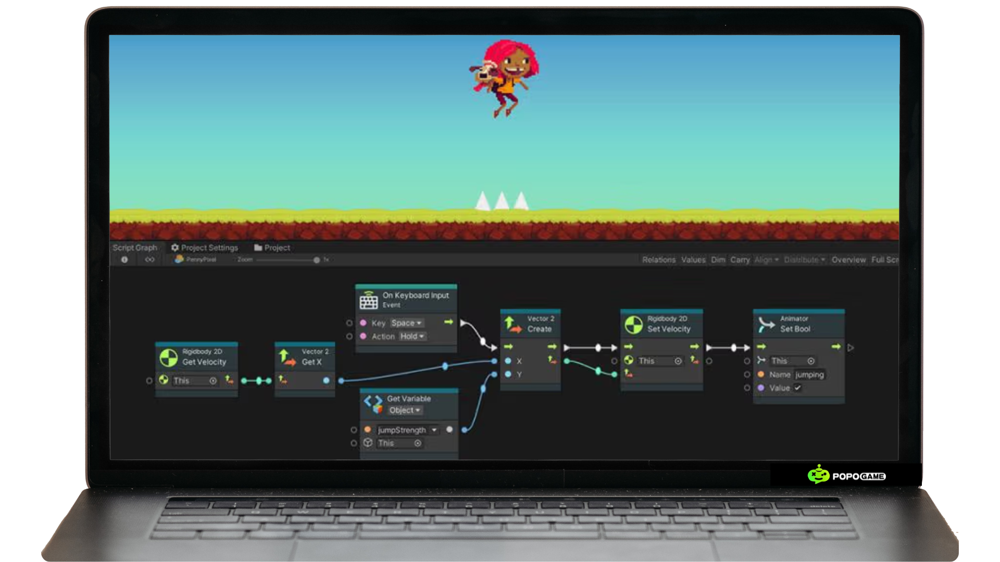
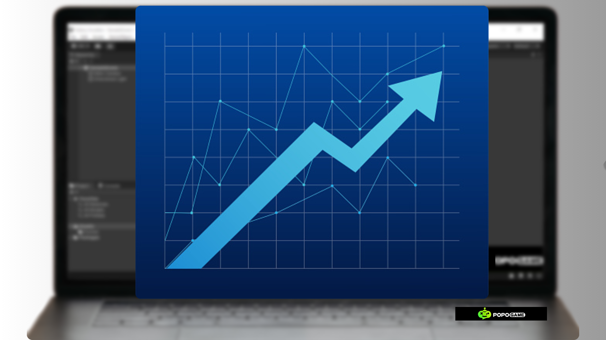
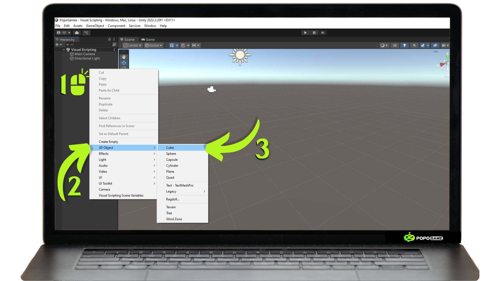
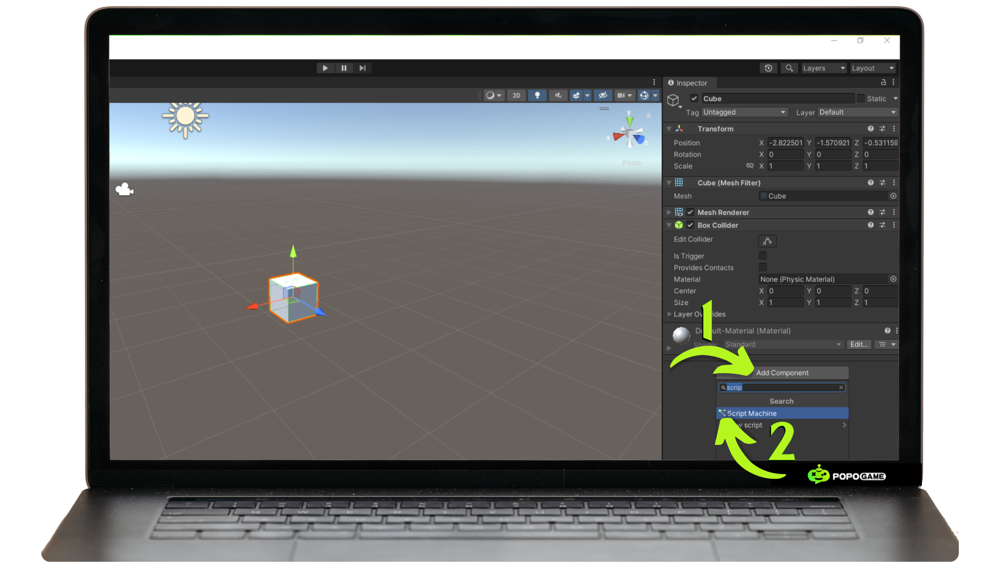
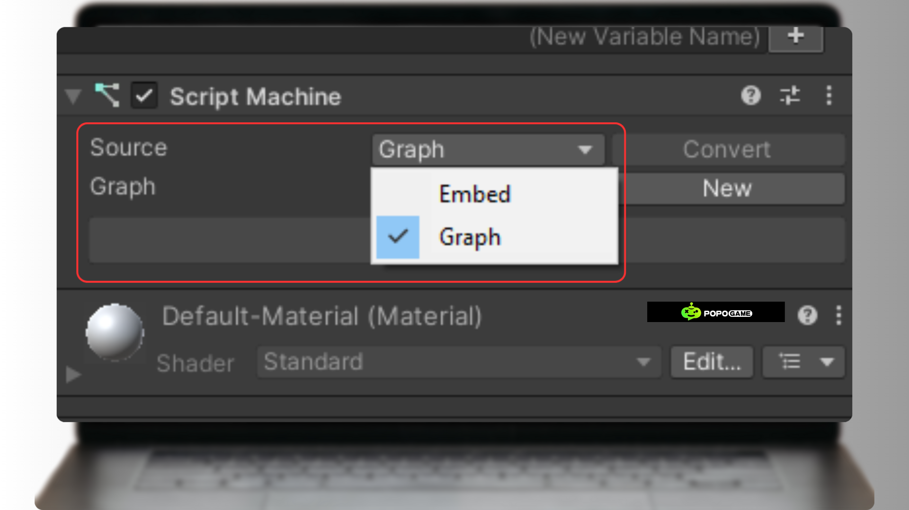
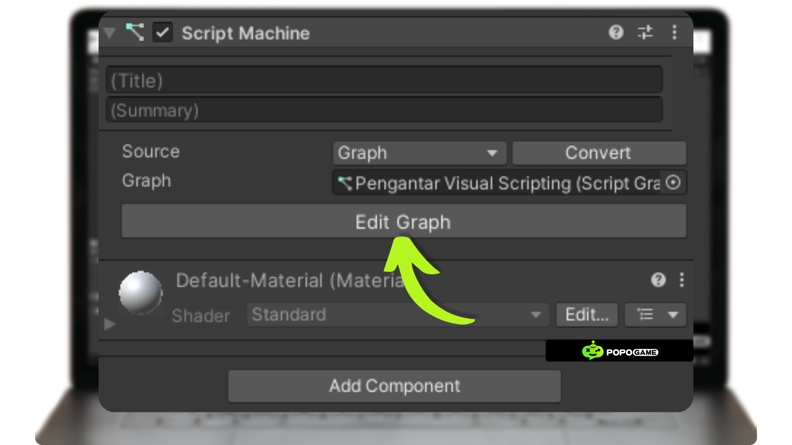
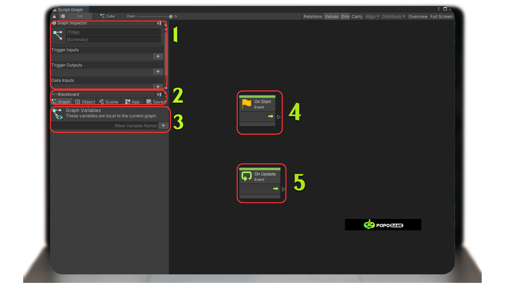

# How to upload 2D or 3D Objects in Unity Considering the Performance Factor of the Game to be Created 

## What is Unity Visual Scripting?

Unity has a method for creating games without coding, you know. It's called Unity Visual Scripting. Here, you can create character movements or even entire games without coding using C#.

Visual scripting in Unity is a feature that makes it easier for team members to develop programming logic using an intuitive graphical interface. With drag-and-drop mechanics, users can create logic flows without having to write code manually, making the development process easier even for those without a programming background.

This feature not only simplifies logic creation but also encourages better collaboration among various team members, such as programmers, artists, and designers. This collaboration allows creative ideas from different disciplines to be implemented more quickly and efficiently. Additionally, visual scripting greatly supports the prototyping and iteration process in application or game development. Teams can easily try out various concepts, identify errors, and make adjustments without requiring complex code changes, significantly saving development time.

With its flexible and user-friendly capabilities, visual scripting becomes an ideal solution to enhance productivity and accelerate project development in Unity.

## How to Add Visual Scripting to Your Project

To add visual scripting to your project, you need to check the version of the Unity editor you are using. If you are using Unity editor version 2021.1 or higher, you do not need to add Unity Visual Scripting manually. However, if you are using a version below that, you need to add Unity Visual Scripting to your project using the Unity Asset Store.

**1. Scene**
You need to enter the scene, either an existing scene or a newly added one by right-clicking on project files -> Scenes. Then, add a 3D cube object to which we will later add the Visual Scripting.

**2. Add a Script Machine** to the object you want to program using visual scripting by pressing the add component button -> ScriptMachine -> Click or Enter.

**3.** Next, you need to **add a new graph** by pressing the new button. However, there are two options here: embed and graph in the source selection. Here are the meanings of both:

**Embed : **
- Integrated: If you choose the Embed option, the graph will be embedded directly within the State Machine or Script Machine. This means the graph becomes part of the asset.
- Less flexible: An embedded graph cannot be easily reused in other assets. If you want to use it elsewhere, you must duplicate it.
- Potential conflicts: If you change an embedded graph, the changes will directly affect all State Machines or Script Machines that use it. This can lead to potential conflicts if you are not careful.

**Graph : **
- Separate file: When you choose the Graph option, the graph you create will be saved as a separate asset file.
- Reusability: This graph can be reused in various State Machines or Script Machines by referencing the asset file.
- Better management: You can easily organize and edit the graph separately, making it easier to manage large projects.

**4.** After you have determined which Source to use, next you **press the edit graph button** to edit the graph file you created.

**5. A Script Graph page will appear** containing nodes that serve as containers for the logic you will apply to the selected object. These nodes will interconnect to form a graph. Below is a more detailed explanation of the interface in this graph.

**1. Graph Inspector:** This section provides general information about the graph, such as summary, title, and various available inputs and outputs. 

**2. Blackboard:** This is the storage area for global variables that can be accessed by all nodes in the graph. These variables can be numbers, text, objects, or other data types. 

**3. Graph Variables:** These are local variables that only apply within the current graph. These variables can be used to store temporary data needed in calculations or logic within the graph. 

**4. On Start Event:** This node will run once when the game starts or when the object with this script is first activated. It is usually used for initializing variables, loading assets, or performing other setup actions. 

**5. On Update Event:** This node will run every frame (once per game update). It is usually used for continuous updates, such as checking user input, calculating physics, or drawing objects on the screen.
